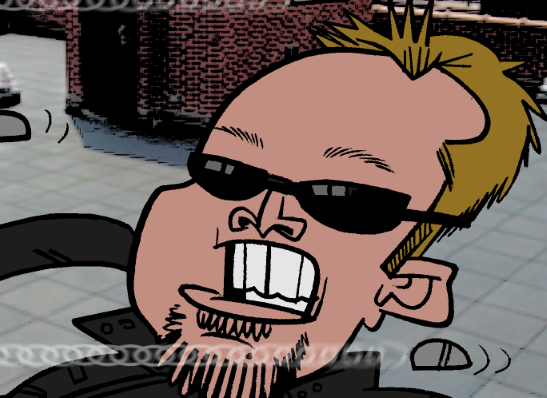

<section id="about-me">
  <header>
    <h2>IASC 2P02 | Nick Gustafson</h2>
    <h3>About Me</h3>
  </header>
  
  

Nick Gustafson is a second year Interactive Arts and Science student at Brock University.  He holds an advanced diploma in Computer Science Technology (with High Honours) from Sheridan College and has worked for nine years as a web developer for Endo Networks.

</section>

<h3>Blog Post</h3>
<a href="blog.html">Blog Post</a>
