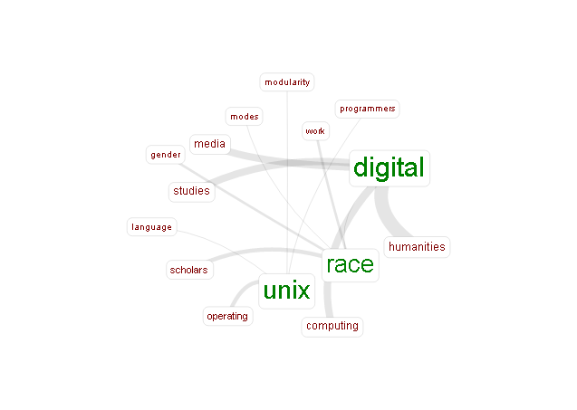
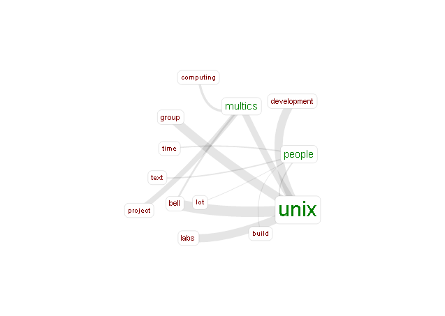

<section id="blog-body">
<header>
<h2>IASC 2P02 | Nick Gustafson</h2>
<h3>Is Programmatic Thinking Racist?</h3>
<h5>Academic Blog</h5>
</header>

Tara McPherson is a scholar with a professed &quot;academic interest in race, gender, and certain modes of theoretical inquiry&quot; (McPherson, 2012) 
who has taken a more recent turn in &quot;digital production and design&quot; (McPherson, 2012).  It is hardly surprising therefore that she had long 
sought and found a way to link these two interests into a single theory to explain how the hidden nature of technology has impacted considerations 
of race in the study of digital humanities.

In the same way that Johanna Drucker challenged the work of scholars like Franco Moretti for accepting &quot;supposedly self-evident &quot; data as &quot;objects 
whose identity was established by interpretative decisions&quot; (Drucker, 2011), it is perfectly reasonable for McPherson to go deeper and challenge the 
very medium in which data is presented.  Svensson would seem to agree that &quot;digital tools should not be seen as neutral artifacts. In their construction and contextual use, 
they reproduce certain assumptions.&quot; (Svennson, 2010).

The argument of McPherson focuses on the development of the UNIX operating system at Bell Labs in the 1960s, and not only places this within the 
proper historical and cultural context of events such as the Civil Rights Movement, but suggests that  the events &quot;coconstitute [sic] one another, 
comprising not independent slices of history but instead related and useful lenses.&quot; (McPherson, 2012).  However, this appears to contradict her earlier 
assertion that she was not &quot;arguing that one mode is causally related to the other, but, rather, that they both represent a move toward fragmentary 
or modular ways of knowing and of organizing information&quot; (McPherson, 2007).  She clarifies that she does not believe that the developers of UNIX 
were racists or had &quot;consciously encod(ed) new modes of racism and racial understanding into digital systems.&quot;(McPherson, 2012).  So, while it is 
clear that &quot;these technologized ways of seeing and knowing took shape in a world also struggling with shifting knowledges and representations of 
race&quot; (McPherson, 2007), she does not offer any definitive evidence of a connection beyond the coincidence of timing and similarity of structure.

Indeed, one would imagine that the casual user of digital tools such a word processing programs, the neutrality of which could be &quot;arguably more 
easily construed&quot; (Svennson, 2010), would hardly know or care how the code is internally organized.

Of course there are a myriad number of ways that humans categorize themselves beyond race. If the digital humanities were more predisposed to &quot;cultural 
studies of the Anglophone sort&quot; (Svensson, 2010), should a connection be drawn to the fact UNIX was developed by English-speaking Americans and that 
many programming languages including C (and its descendants) extensively use loan words and syntax from English? Along similar lines, given that the 
developers of UNIX and C were men, the question &quot;Why are the digital humanities so male?&quot; should be a valid one were it not for the fact that, regardless 
of this, there appear to be a significant number of female scholars in this field.  Beyond McPherson herself and Johanna Drucker, perhaps half of the 
works cited by male scholar Svennson are women.

Supposing that a direct connection does exist between the events described, must it necessarily be one of cause and effect?  Is it not possible that a 
third event or sequence of events had an effect on both, thereby accounting for the similarities that McPherson has described?  Another possibility which 
presents itself is that connection is in the opposite direction that McPherson supposes;  that the emergence of digital systems popularized the 
&quot;modularity and encapsulation&quot; (McPherson, 2012) that was embraced by identity politics in the 1960s.

However, if we do allow that a connection exists, that its nature is as McPherson states.  and that therefore UNIX was from its conception a product of  
(unintentional) racism, what is to follow from that conclusion?  If it is racist, it is racist to collections of code.  People, unlike programs, are not 
designed to implement specific functions in the most efficient way possible.  A program that does not need to know everything and will not require particular 
access or functionality will not be hurt by having those hidden or denied to it.  McPherson makes a strong case for how concepts of  
&quot;modularity, fragmentation, and dispersion&quot; (McPherson, 2007) have negative consequences when applied to human interactions over the last half century, but 
with a possible exception of sapient artificial intelligence, it is simply the best way that has been found for efficient digital interactions, regardless 
of its origin.

Tellingly, when McPherson allows that advantages exist for this manner of coding, she then asserts that it &quot;underscore(s) a worldview in which a troublesome 
part might be discarded without disrupting the whole&quot; (McPherson, 2012).   In this manner, she has ascribed to programmers a single-mindedness whereby they 
would approach problems in the digital world in the same manner as the physical, which is ridiculous (and a bit offensive).

<strong>Addendum</strong> 
It is conceivable that, as some have suggested, the manner in which McPherson presents her ideas could be alienating to the audience she is trying to connect with.  It is possible that
she is being deliberately provocative in order to make the reader question their assumptions and consider new possibilities.  If that is the case, I believe she was successful, but might have been equally so if she suggested that
Fanta drinkers were racist because the soda was developed in Nazi Germany.  

I created the Voyant visualizations of McPherson's article and a history of UNIX to see if connections or at least similar terms appeared in both works.  It is interesting to note that while the former does not link &quot;UNIX&quot; to &quot;race&quot; and &quot;gender&quot;, the latter does actually connect &quot;UNIX&quot; to &quot;group&quot; and &quot;people&quot;, which I suppose could provide some validation for her argument.  

Personally, I would apply the concept of modularity to software and equate it to ease of portability and code reuse. For instance, although a PHP web application might allow individual pages to specify a database provider, server url, user name and password, in practice, it is far more beneficial to encapsulate the implementation details in a class that can be used by multiple pages.  Case in point, a website I created for HIST2F27 used different providers in development and production, but because I hid the connection information from the pages, they could be used in a different environment with very little modification.  I cannot see how this idea could be successfully applied to people.

</section>

<section id="visualization">
<header>
<h3>Visualization</h3>
</header>
<figure>

<figcaption>A "Links" visualization of McPherson's 2012 article (from http://voyant-tools.org)</figcaption>
</figure>

<figure>

<figcaption>A "Links" visualization of a Princeton article on the development of UNIX (from http://voyant-tools.org)</figcaption>
</figure>
</section>

<section id="works-cited">
<header>
<h3>Works Cited</h3>
</header>
<ol>
<li>Drucker, Johanna (2011). "Humanities Approaches to Graphical Display". Digital Humanities Quarterly. Retrieved from http://www.digitalhumanities.org/dhq/vol/5/1/000091/000091.html</li>
<li>McPherson, Tara (2007). "Introduction to Difference Issue". Vectors Journal. Retrieved from http://vectors.usc.edu/issues/index.php?issue=5.</li>
<li>McPherson, Tara (2012). "Why Are the Digital Humanities So White? or Thinking the Histories of Race and Computation". Debates in Digital Humanities. Retrieved from http://dhdebates.gc.cuny.edu/debates/text/29.</li>
<li>Svensson, Patrik (2010). "The Landscape of Digital Humanities". Digital Humanities Quarterly. Retrieved from http://digitalhumanities.org/dhq/vol/4/1/000080/000080.html.</li>
<li>"Unix: An Oral History". Retrieved from https://www.princeton.edu/~hos/frs122/unixhist/finalhis.htm.</li>
</ol>
</section>
