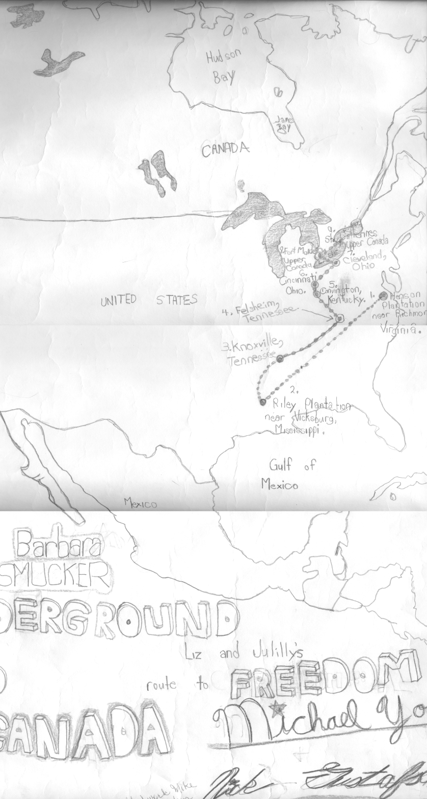

<section>
<header>
<h2>IASC 2P02 | Nick Gustafson</h2>
<h3>StoryMapJS featuring &quot;Underground to Canada&quot;</h3>
<h5>Collaborative Project</h5>
</header>					

<figure>
<a href="images/original_utc.png">
<figcaption>The original story map</figcaption></a>
</figure>

<strong>Project Description</strong> 
Our group examined the history and features of the StoryMapJS tool developed at Northwestern University.  StoryMapsJS creates geographical representations of event sequences, combining features of common presentation and mapping software.   Despite the name, StoryMapJS can be used to illustrate non-fiction "stories" as well as fiction ones and, with the appropriate graphics, locations that do not currently exist or may never have existed.  To demonstrate this tool, we mapped the events of Smucker's novel "Underground to Canada", supplemented by relevant quotations and historical images.  The demo recreated a similar project of mine from the fifth grade <strong>(above)</strong>.

<!--
Project Description (100 words) introducing us to the work undertaken: the digital humanities project/
platform/tool you engaged with, what you produced using that project, and your research findings.
-->

<strong>Collaboration Statement</strong> 
In theory, my approach to collaborative scholarship would involve equal contributions by all participants.  Each group member would bring forward an idea and the group would select the best one (or a synthesis of the best ones) to proceed with.  The requirements would be analyzed and the work would be fairly distributed based upon a combination of ability, interest and availability.  As work proceeded, the team would regularly communicate by email and meet in person as necessary (at least once before the project deadline).  By the end of the project, each group member would have gained an equal understanding of the subject matter.  
In practice, as is so often the case, very little of this actually transpired.  I originated an idea and it was adopted by the group without any alternatives offered or much discussion, despite prompting.  I wanted to do StoryMapJS as a topic because its capabilities were a good match for the old project I remembered, and as it turned out, there were no other story suggestions.  We did review the requirements as a group and divided the research topics amongst the group members present.  For my part, I volunteered to create both the demonstration and the PowerPoint slides.  
The best that I can say about collaborative research is that it <em>should</em> reduce my personal workload and counteract my tendency towards procrastination when working independently.  Not to complain about getting my own way consistently, but it might be nice to follow sometimes.

<!--
Collaboration Statement (250 words) that explains how you approach collaborative scholarship, with
examples of work done for the team project as evidence of the approach you describe. How does
collaboration enrich your academic thinking? Are there any digital materials, approaches, or workflows
you use when working in a team? How do you situate collaborative research within the digital
humanities—how does collaboration, as you approach it, advance your stated research agenda?
-->

<a href="https://brocku-my.sharepoint.com/personal/ng15fj_brocku_ca/_layouts/15/guestaccess.aspx?docid=0fbbb61338617493da7bc80063e958e03&amp;authkey=AbQduR6YxP174-JkBwFUPMs">Slides</a>
<a href="https://uploads.knightlab.com/storymapjs/d2b3daec4e5d99924036da6e3be830fa/undergroundtocanada/">StoryMapJS Project</a>
</section>
